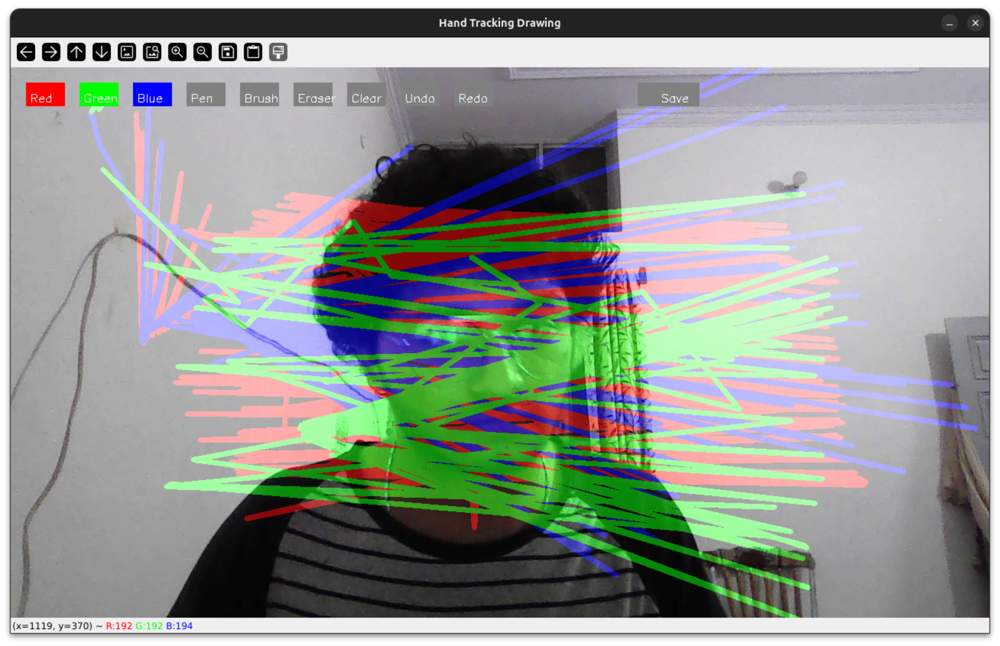
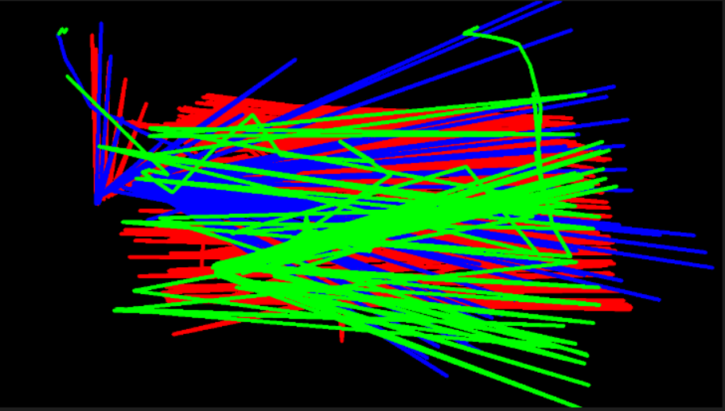

 

 

 

 
openCanvas is an innovative application developed using OpenCV that allows 
users to draw on their webcam feed in real time.
The project combines computer vision with interactive drawing tools, providing a dynamic and engaging user experience.
Once the drawing is complete, users can save their creations as PNG files.

 

### Key Features:

- Real-Time Webcam Feed: The application captures and displays the live feed from the user's webcam, providing a canvas to draw on.

- Drawing Tools: Users can interact with the webcam feed using drawing tools, allowing them to create and modify visual content directly on the video stream.

- Save Functionality: The application includes a feature to save the current drawing as a PNG file, preserving the user's artwork.

### Technical Details:

- OpenCV Integration: Utilizes OpenCV for capturing the webcam feed and processing the video stream.

- Drawing Capabilities: Implements drawing functionalities such as lines, shapes, and freehand drawing on the webcam feed.

- File Saving: Incorporates a method to export the current state of the drawing to a PNG file, enabling users to save their work.

### Versions

- v-0.1 : Currently made this version which allow 3 colors , 2 shape of pen and save button . Other functionalty will be added in future  

#### Snapshot

Photo  | Purpose
------------- | -------------
  | This is how the opencv window will look like.
| This is the photo that is going to be stored.

